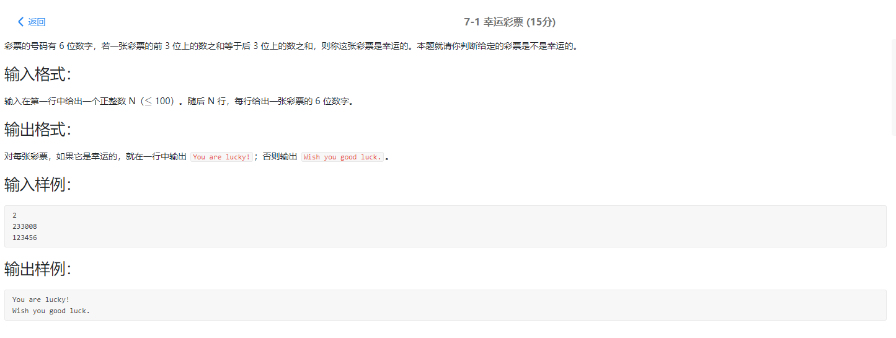
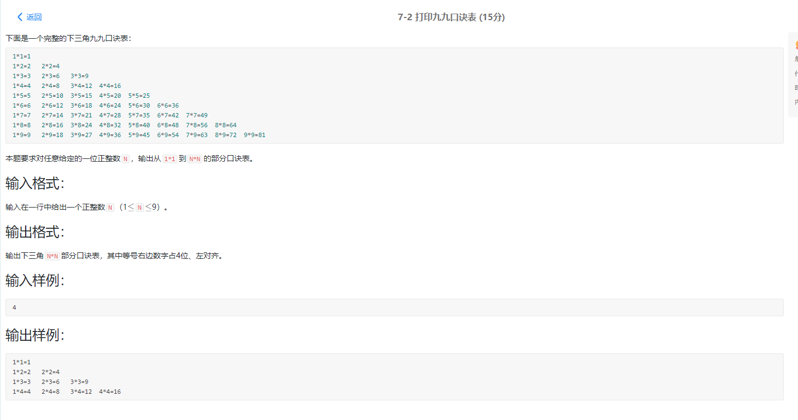
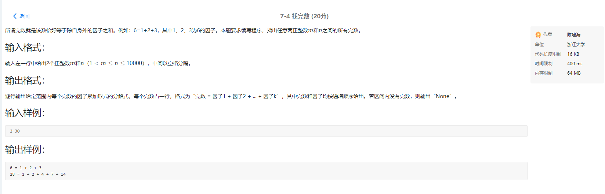
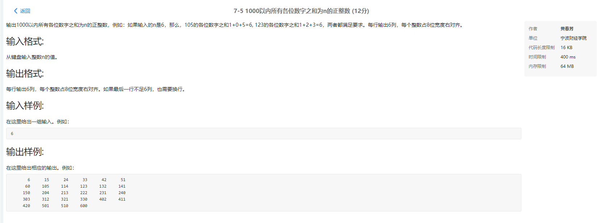
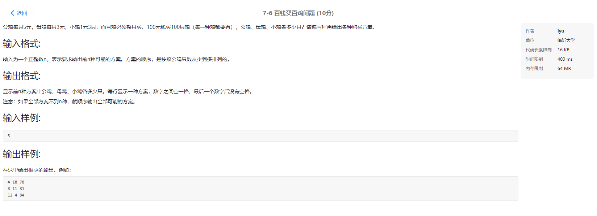
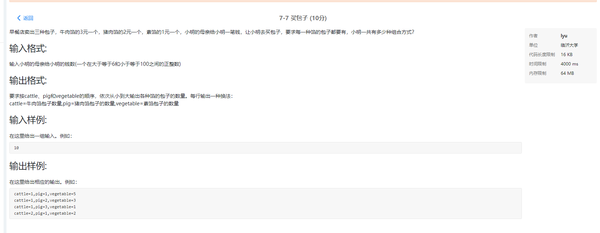
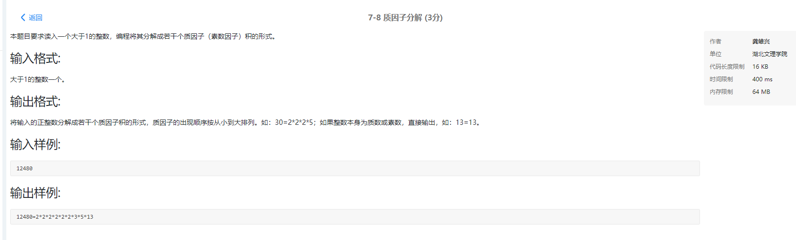

 

```
# include<stdio.h>

int main()

{
  int a,b,c,d,e,f,g,h;

  scanf("%d",&a);

  for(b=0;b<a;b++)

  {

​    scanf("%1d%1d%1d%1d%1d%1d",&c,&d,&e,&f,&g,&h);

​    if(c+d+e==f+g+h)

​    {

​      printf("You are lucky!\n");

​    }

​    else

​    {

​      printf("Wish you good luck.\n");

​    }
  }

  return 0;

}
```



```
#include <stdio.h>

#include <math.h>

#include <stdlib.h>


int main () {


  int n;

  scanf("%d",&n);


  for (int i = 1; i <= n; i++)

  {

​    /* code */

​    


​    for (int j = 1; j <= i; j++)

​    {

​      /* code */

​      printf("%d*%d=%-4d",j,i,j*i);


​    }

​    

​    printf("\n");

  }

  // printf("%d",a[0]);

  

  


  return 0;

}
```


```
#include<stdio.h>


int judge(int n)

{

 int i;

 for (i = 2; i < n; i++)

 if (n%i == 0)break;

 if (i < n) return 0;

 else return 1;

}


int main()

{

 int judge(int n);

 int m, i, count = 0;

 scanf("%d", &m);

 for ( i = m-1; i > 1; i--)

 {

 if(judge(i))

 {

  printf("%6d", i);

  count++;

 }

  // for (int j = 2; j < i; j++)

  // {

  //   /* code */

  //   if (i%j==0)

  //   {

  //     /* code */

  //     continue;

  //   }

  //   else if (j%i)

  //   {

  //     /* code */

  //     continue;

  //   }

  //   else

  //   {

  //     printf("%6d", i);

  //     count++;

  //   } 

​    

  // }

  

 if (count == 10)break;

 }

}
```



```
#include<stdio.h>

int main()

{

  int n,i,j,m,sum,c=0;

  scanf("%d %d",&n,&m);

  for(i=n;i<=m;i++)//循环范围

  {

​    sum=1;

​    for(j=2;j<i;j++)//循环数字

​    {

​      if(i%j==0)//判断因数

​      {

​        sum=sum+j;

​      }

​    }

​    if(sum==i)//判断完数

​    {

​      c++;

​      printf("%d = 1",sum);

​      for(j=2;j<i;j++)

​      {

​        if(i%j==0)

​        {

​          printf(" + %d",j);

​        

​        }

​      }

​      printf("\n");

​    }

  }

  if(c==0)

​    printf("None");

  return 0;

}
```



```
# include<stdio.h>

int main()

{

  int a=0,x,temp,count;

  scanf("%d",&a);


​    

  for (int i = 0; i < 1000; i++)

  {

​    /* code */


​    

​    x=i;

​    temp=0;

​    while (x)//将循环数的各位数取出相加

​    {

​      temp += x%10;

​      x /= 10;

​      


​    }

​    if (temp==a)//判断取出相加是否为原数

​    {

​      /* code */

​      printf("%8d",i);

​      count++;//成功时换行数+1

​      if (count%6==0)//成功时进行判断是否应该换行

​      {

​        /* code */

​        printf("\n");

​      }

​      

​    }    


​    

​      

​      // printf("%d ",i);

​    // printf("%d",x);

  }

  

  return 0;

}
```



```
# include<stdio.h>

int main()

{

  int i,j,count=1,max=1;


  scanf("%d",&max);

  for (i = 3; i < 100; i+=3)

  {

​    /* code */

​    for (j = 1; j < 100; j++)

​    {

​      /* code */

​      if (i/3+j*3+(100-i-j)*5==100 && 100-i-j>0)

​      {

​        /* code */

​        if (count<=max)

​        {

​          /* code */

​          printf("%d %d %d\n",(100-i-j),j,i);

​          count++;

​        }      

​          

​      }    

​        

​    }

​      


  }

  

  return 0;

}
```



```
# include<stdio.h>

int main()

{

  int i,j,count=1,max=1;


  scanf("%d",&max);

  for (i = 3; i < 100; i+=3)

  {

​    /* code */

​    for (j = 1; j < 100; j++)

​    {

​      /* code */

​      if (i/3+j*3+(100-i-j)*5==100 && 100-i-j>0)

​      {

​        /* code */

​        if (count<=max)

​        {

​          /* code */

​          printf("%d %d %d\n",(100-i-j),j,i);

​          count++;

​        }      

​          

​      }    

​        

​    }

​      


  }

  

  return 0;

}
```



\

```
#include<stdio.h>

int main(){

  int i=2,k;

  scanf("%d",&k);

  printf("%d=",k);//打印出预先值

  while(k>1){

  

​    if(k%i==0)//判断是否可以取余,可以则打印出可以取余的值

​    {

​      printf("%d",i);k/=i;

​      if(k!=1)

​      {

​        printf("*");

​      }

​    }

​    else 

​    {

​      i++;

​    }//取余失败则把取余值加1

  }

}
```

